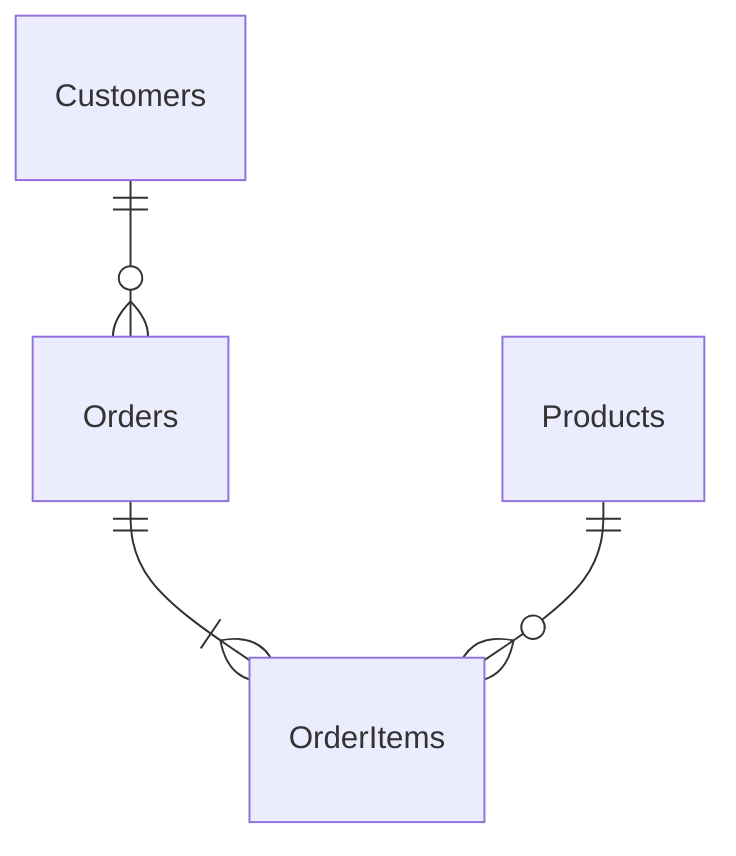

# Guard Dog 🐕

**A production-grade .NET 10 Worker Service that detects database schema drift between your EF Core model and a live database — before your application notices.**

[](https://github.com/you/guard-dog/actions)

---

## The Problem

Schema drift happens when a database is modified outside of your normal migration pipeline — a hotfix applied directly in production, a DBA adding an index, a column renamed in a legacy script. Your application's EF Core model now disagrees with the live database, and you won't find out until a `SqlException` hits a user at 2 AM.

**Guard Dog watches for this around the clock.**

---

## Architecture

```
┌─────────────────────────────────────────────────────────┐
│                      CI/CD Pipeline                       │
│                                                           │
│  dotnet build MyApp  →  GuardDog.SnapshotTool            │
│                          ↓                               │
│               snapshot.json  (Shadow Schema)              │
│                          ↓                               │
│            Embedded into GuardDog.Worker image            │
└──────────────────────────┬──────────────────────────────┘
                           │
                           ▼
┌─────────────────────────────────────────────────────────┐
│                    GuardDog.Worker                        │
│                                                           │
│   ┌──────────────┐    ┌─────────────────────────────┐   │
│   │ Shadow Schema│ vs │  Live DB Schema              │   │
│   │ (JSON, baked │    │  (INFORMATION_SCHEMA queries)│   │
│   │  at build)   │    │                             │   │
│   └──────┬───────┘    └──────────────┬──────────────┘   │
│          └────────────┬──────────────┘                   │
│                       ▼                                   │
│             DriftDetector.Detect()                        │
│                       │                                   │
│          ┌────────────┴───────────────┐                   │
│          ▼                            ▼                   │
│   Slack / Teams Alert         Prometheus Metrics          │
│   (with Fix-It SQL)           db_drift_detected{...}     │
│                                                           │
│   docs/database.md  ←  Mermaid erDiagram generator       │
└─────────────────────────────────────────────────────────┘
```

---

## Five Phases Implemented

### Phase 1 — The Drift Engine
Uses EF Core's public metadata API (`context.Model.GetEntityTypes()`, `GetTableName()`, `GetColumnName()`, `GetIndexes()`, `GetForeignKeys()`) to extract the code model. Compares it against live `INFORMATION_SCHEMA` queries using clean ADO.NET — no design-time assemblies at runtime.

**Drift categorisation:**
| Severity | Examples |
|---|---|
| 🔴 Critical | Missing table, missing column, type mismatch — will throw at runtime |
| 🟡 Warning | Nullability mismatch, missing FK — may cause constraint violations |
| 🔵 Informational | Extra DB index, unmapped column — application unaffected |

### Phase 2 — The Shadow Schema
`GuardDog.SnapshotTool` is a CI/CD tool that introspects the EF Core model at build time and writes a `snapshot.json`. This JSON is embedded in the Worker image so it knows exactly what the deployed code expects — independent of the running application.

```bash
# In CI, after building your application:
dotnet run --project src/GuardDog.SnapshotTool -- \
  --assembly  ./publish/MyApp.dll \
  --context   MyApp.Data.AppDbContext \
  --output    ./snapshot.json \
  --version   "$GITHUB_SHA"
```

The snapshot also includes a **SHA-256 hash** of the schema for tamper detection and fast equality checks.

### Phase 3 — Alerting Engine
Structured webhook alerts with Block Kit (Slack) and Adaptive Cards (Teams):
- Colour-coded by severity (🔴 red / 🟡 orange)
- Lists each drift item with code state vs DB state
- Attaches the **Fix-It SQL script** so your on-call engineer can act immediately
- Fan-out via `CompositeAlertService` — one drift event notifies all channels

### Phase 4 — Mermaid ER Diagram
On every successful check the worker overwrites `docs/database.md` with a live Mermaid `erDiagram`. GitHub renders this natively in the repo wiki. The diagram shows:
- All entity tables with column types and PK/FK annotations
- Relationships with Crow's Foot notation (`||--o{`)



### Phase 5 — Security & Connectivity
- **Managed Identity (Azure)**: set `Authentication=Active Directory Default;` — no password in config
- **IAM Role (AWS)**: attach the role to the ECS Task; the SDK picks it up automatically
- Worker runs as a **non-root user** in Docker (see `Dockerfile`)
- DB login requires only `SELECT` on `INFORMATION_SCHEMA` and `VIEW DEFINITION` — never `db_owner`
- Connection string never logged — `ExtractDataSource()` strips credentials before writing to logs

---

## Senior Polish (Nice-to-Haves)

| Feature | Status |
|---|---|
| Drift categorisation (Critical / Warning / Informational) | ✅ |
| Fix-It SQL script generation (ALTER TABLE / CREATE INDEX / ADD FK) | ✅ |
| Prometheus metrics (`db_drift_detected`, `db_check_duration_seconds`) | ✅ |
| Multi-database support (SQL Server + PostgreSQL, extensible to MySQL) | ✅ |
| Mermaid ER diagram with FK relationships | ✅ |
| Non-root Docker image | ✅ |
| Composite alerting (Slack + Teams in parallel, failures isolated) | ✅ |
| Deterministic model hash for change detection | ✅ |

---

## Project Structure

```
guard-dog/
├── src/
│   ├── GuardDog.Core/              # All business logic (zero framework coupling)
│   │   ├── DriftEngine/            # Phase 1: IDriftDetector, DriftDetector
│   │   ├── Schema/                 # Live DB readers (SqlServer, PostgreSQL)
│   │   ├── Snapshot/               # Phase 2: EfCoreSnapshotGenerator
│   │   ├── Alerting/               # Phase 3: Slack, Teams, Composite
│   │   ├── Diagram/                # Phase 4: MermaidErDiagramGenerator
│   │   ├── Metrics/                # Phase 5: Prometheus GuardDogMetrics
│   │   └── Models/                 # DriftItem, DriftReport, SchemaSnapshot, ...
│   ├── GuardDog.Worker/            # .NET Worker Service host
│   │   ├── Worker.cs               # Background service — orchestrates everything
│   │   ├── Program.cs              # DI wiring, Prometheus HTTP endpoint
│   │   ├── appsettings.json        # Configuration (no secrets here)
│   │   └── Dockerfile
│   └── GuardDog.SnapshotTool/      # CI/CD CLI — generates snapshot.json
└── tests/
    └── GuardDog.Core.Tests/        # 26 unit tests (xUnit + FluentAssertions)
        ├── DriftDetectorTests.cs   # 12 tests covering all drift scenarios
        ├── MermaidGeneratorTests.cs # 7 tests covering diagram generation
        └── SnapshotSerializationTests.cs # 7 tests for JSON round-trip & hash
```

---

## Quick Start

### Prerequisites
- .NET 10 SDK
- SQL Server or PostgreSQL instance
- (Optional) Slack / Teams webhook URL

### 1. Configure

```json
// src/GuardDog.Worker/appsettings.json (or use environment variables)
{
  "GuardDog": {
    "ConnectionString": "Server=myserver;Database=MyDb;Authentication=Active Directory Default;",
    "Provider": "SqlServer",
    "CheckInterval": "00:05:00",
    "AlertThreshold": "Warning",
    "Slack": { "WebhookUrl": "https://hooks.slack.com/..." }
  }
}
```

### 2. Generate the Shadow Schema Snapshot

```bash
# Build your app first, then:
dotnet run --project src/GuardDog.SnapshotTool -- \
  --assembly ./publish/MyApp.dll \
  --context  MyApp.Data.AppDbContext \
  --output   snapshot.json
```

### 3. Run the Worker

```bash
dotnet run --project src/GuardDog.Worker
# Metrics available at: http://localhost:9090/metrics
```

### 4. Run in Docker

```bash
cp snapshot.json src/GuardDog.Worker/
docker build -f src/GuardDog.Worker/Dockerfile -t guard-dog .
docker run \
  -e GuardDog__ConnectionString="..." \
  -e GuardDog__Slack__WebhookUrl="..." \
  -p 9090:9090 \
  guard-dog
```

---

## Prometheus / Grafana

Scrape `http://guard-dog:9090/metrics` and import this dashboard panel:

```promql
# Alert rule: drift detected in last 10 minutes
db_drift_detected{provider="SqlServer"} == 1

# SLA panel: % of checks that were clean
rate(db_checks_total{result="clean"}[1h]) /
  rate(db_checks_total[1h])

# Check latency P95
histogram_quantile(0.95, rate(db_check_duration_seconds_bucket[5m]))
```

---

## Extending to MySQL

Add a `MySqlSchemaReader : IDatabaseSchemaReader` and register it in `DatabaseSchemaReaderFactory`:

```csharp
"mysql" => new MySqlSchemaReader(),
```

`INFORMATION_SCHEMA.TABLES` and `INFORMATION_SCHEMA.COLUMNS` queries are identical for MySQL. Only the index query needs adjustment (use `information_schema.STATISTICS`).

---

## Security Checklist

- [ ] DB login has `SELECT` on `INFORMATION_SCHEMA` only — not `db_owner`
- [ ] Connection string sourced from Key Vault / Secrets Manager — not appsettings
- [ ] Prometheus `/metrics` endpoint protected by network policy or reverse proxy
- [ ] Docker image runs as non-root (`USER guarddog`)
- [ ] Slack/Teams webhook URLs stored as GitHub Secrets, not in source
