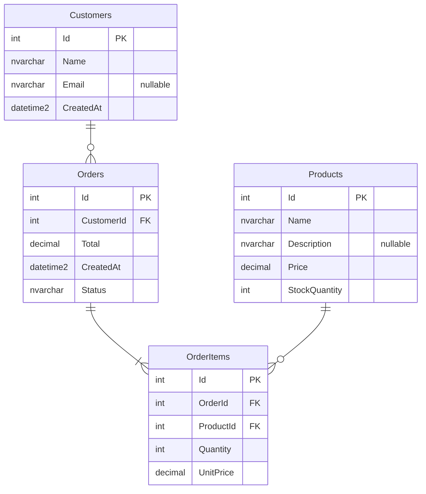

# Database Schema

> Auto-generated by Guard Dog · This file is overwritten on every successful worker check.
> Edit the EF Core model, not this file.

```mermaid
erDiagram
    Customers {
        int Id PK
        nvarchar Name
        nvarchar Email "nullable"
        datetime2 CreatedAt
    }
    Orders {
        int Id PK
        int CustomerId FK
        decimal Total
        datetime2 CreatedAt
        nvarchar Status
    }
    OrderItems {
        int Id PK
        int OrderId FK
        int ProductId FK
        int Quantity
        decimal UnitPrice
    }
    Products {
        int Id PK
        nvarchar Name
        nvarchar Description "nullable"
        decimal Price
        int StockQuantity
    }

    Customers ||--o{ Orders : ""
    Orders ||--|{ OrderItems : ""
    Products ||--o{ OrderItems : ""
```
